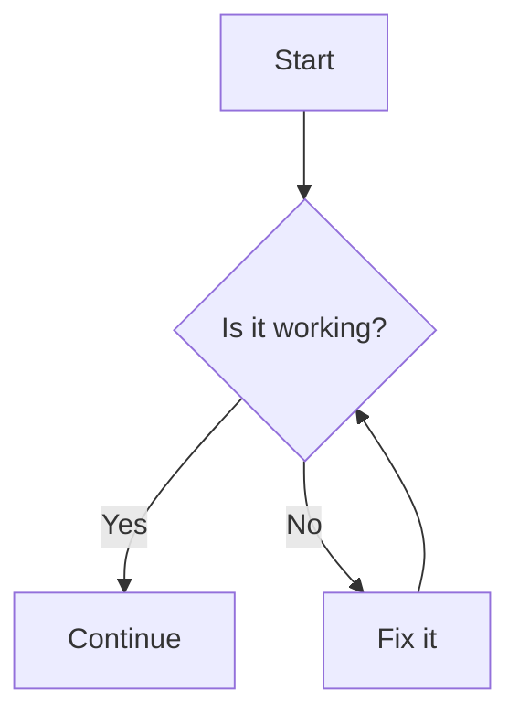

# Markdown to PDF demo

This file demonstrates all CSS styles applied by a custom `markdown-pdf.css` style sheet file when using the [Markdown PDF](https://marketplace.visualstudio.com/items?itemName=yzane.markdown-pdf) Visual Studio Code extension. This css file includes the ability to create styling for code blocks, headings, callout blocks for notes, inline elements, page breaks, table positioning, and emoji. The full style sheet is located at the end of this document in the [Complete style sheet](#complete-style-sheet) section.

---

## Headings
### H2 Example
#### H3 Example 

An example of body text.

---

## Lists
- Item one
- Item two
  - Nested item.


1. First
2. Second
3. Third
   * first bullet under numbered item
   * second bullet under numberd item

---

## Inline code
Inline code is styled with dark gray text and light gray blackground. For example, use `parameter_name` in your request. The css style sheet also includes the same formatting for inline code use in tables. 

|Error Condition|`error.message`|Description|
|:----|:----|:----|
|Missing fields|Request validation failed|One or more fields are missing or have the wrong type/format. See `error.details`.|


## Emojis for callouts

The extension relies on Chromium to render emojis which can result in black and white versions of the emojis being used. In some cases, it is possible to simply copy emoji from a published page and use Markdown formatting when exporting to HTML or another formating other than PDF. Note that the css style applied both font colors and background colors to callouts in the CSS file. 

These are typical emojis created using the Windows emoji menu. While the extension allows you to direct export as PDF, it renders the "NOTE" emoji and any others added using the Windows emoji menu or pasted into the Markdown file. Only the blue info emoji, red warning emoji, and the yellow caution sign render correctly when directly exporting as a PDF using the extension. For HTML and image file types, these emoji are generally supported. The workaround to successfully creating a PDF is to export as an HTML file using the Markdown PDF extension and then using the "Print to PDF" printing command available in a brower to print the HTML page as a PDF.

📘🔴🟢ℹ️⚠️🚧

**Sample callouts**

> 📘 **NOTE:**
> 
> This tutorial uses the following:
> * MacOS
>
> Please modify accordingly if your developer environment differs from these details. (This was copied and formatted with Markdown.)

<blockquote class="note">
This is a general note for developers.  It should contain useful information. (It uses the CSS file and HTML.)
</blockquote>

<br>

<blockquote class="info">
This is for useful information also. It is an alternative to using the blue Note emoji. (It uses the CSS file and HTML.)
</blockquote>


<br>

> ❗️**WARNING:**
> 
> All information from the handset must go through REST API requests you send. It is your responsibility to ensure security at the application and API levels. In particular, you must not distribute your credentials in the application. (This was copied and formatted with Markdown.)


<blockquote class="warning">
This is a warning note to be careful. (It uses the CSS file and HTML.)
</blockquote>

<br>

> 🚧 **CAUTION:**
> 
> Be sure that all headers in your string-to-sign beginning with "x-ts-" are in alphabetical order. Authentication fails if these headers are not in alphabetical order! (This was copied and formatted with Markdown.)

<blockquote class="caution">
Use caution when editing production flows. (This uses the CSS file and HTML.)
</blockquote>


## Complex callouts

You can also create longer callouts using the blockquote CSS class but a manual break <br> may be needed. 

<blockquote class="note">
This is a general note for customers. Lets make a second paragraph because sometimes callouts need a second paragraph.

Some more text because this belongs in the same NOTE.
</blockquote>


Sometimes warnings and notes need to be indented. 

1. First step. 
2. Second step that needs a caution in it.
   <blockquote class="caution">
    This is an indented <b>CAUTION</b> note. Useful when a note needs to be placed in a ordered procedural steps.</blockquote>    
3. A third step that needs to be done. Because the word "caution" above is inside the blockquote, use HTML formatting to apply bold formatting.  

<br />

<blockquote class="caution">
A standard caution without indents.
</blockquote>


If callouts are too close to text or images, try using \<br /> to keep spacing neat. 

## Emojis for status codes

Depending on the file type you are saving, it is possible to use the emoji menu to paste in an emoji. Sometimes this will work for exporting a file to a format other than PDF when using the Markdown PDF expenteison. Here are two examples.

🟢 **200** **Success.**

🔴 **400** **Request validation failed.** 

As an alternative, the CSS style sheet has an option to format the red and green circles. You can add other emoji to the style sheet. The CSS controls the look and the placement of the emojis. Note that CSS style sheet is applying bold to the HTTP status numbers inside the span but Markdown controls the formatting for the labels or text outside the span. The emoji don't appear in the Visual Studio Code preview but they are visible in the HTML page.


<span class="status-ok">200</span>  
**Success.** The request was processed successfully.

<span class="status-ok">200</span> **Success.** The request was processed successfully. 

<span class="status-error">400</span> **Missing Required Parameters.**

Missing required parameters or invalid body fields. 


## Best practices for images

### Classic markdown

Use this for most images. No border.  Don't forget to include alt text.

Note that Markdown doesn't include the ability to change the size of an image. 


## Sample image with a border for white images

This local image has a white background so it needs a border. In this case, the image is in the same directory as the markdown file. It uses the custom CSS for a professional look.

 


## Sample image with alt text


### Examples using HTML to adjust width

This is a publicly posted wikipedia image which is set to a width of 200 pixels. In this case, the image was added using HTML to allow size control for web content. External images hosted on the interest can be large and you may need to control the size to break unwelcome page breaks. 


### Another HTML example with 250 pixels as width

This example is from a locally stored images. It is useful if a local image needs to be a specific size.  


### Manual page breaks

While the CSS style sheet has the ability to preserve tables by keeping an entire table or image on one page, there may be rare cases where a manual page break is needed to keep pages in order. The CSS style sheet has matching instructions for this `new-page` div class that manually forces a page break. Since this may affect screenreaders and other tools, use this div class sparingly. 

**Manual page break below!** Use this div class when the css automatic page breaks aren't enough.

<div class="new-page"></div>

## Diagrams

See the instructions for the Markdown PDF extension on how to include diagrams. 

### Mermaid.js

Mermaid.js is formatted like a code sample so use backticks around the code for the diagram. It will appear with a gray background which is from the Markdown styling layer that’s wrapping around the diagram diagram.

In VS Code (and extensions like Markdown PDF or Markdown Preview Enhanced), fenced code blocks are styled with a background color (usually gray) to distinguish them from normal text.

The renderer treats the diagram as a code block first, then passes the contents to the Mermaid renderer. The outer block styling (gray background, padding, border) are still appled.

This is Markdown’s default CSS for code blocks.

Since this particular CSS style sheet attempts to prevent images and other content from splitting across pages, select diagrams that flow left to right so that diagram is not too long. 



Because the Mermaid.js diagram is a code block, it is possible to add a header like `#### Troubleshooting diagram` over the diagram using the same Markdown formatting as a code block label. 

#### Troubleshooting diagram


To avoid the gray background, add the following to the settings.json file:

```JSON
"markdown-preview-enhanced.mermaidTheme": "default"
```

This ensures that Mermaid diagrams render cleanly without a gray background.

Alternately, Markdown PDF lets you inject custom CSS. You can override the code block background for Mermaid diagrams. Add thefollowing to the CSS style sheet to remove the gray box and allow the diagram to render as a standalone graphic.

```css
pre code.language-mermaid {
  background: transparent !important;
  border: none !important;
  padding: 0 !important;
}
```

### PlantUML

Unlike Mermaid.js diagrams, PlantUML diagrams do not require code blocks (triple backticks) to work. As result these diagrams do not have gray backgrounds like code blocks. 

@startuml
Bob -[#red]> Alice : hello
Alice -[#0000FF]->Bob : ok
@enduml


## Code blocks 

The CSS style sheet adds a langauge header above the code block and removes the gap between the header and the code block below it. 

Use "#### [Language name]" above the code block to create the langage header above the code example. It will be black with white text in all caps. (Although you can adjust the CSS style sheet to change its look.) The Markdown PDF extension supports color syntax so use the offical language name next to the triple backticks at the top of the fenced code. For example, ````json` will enable the JSON color syntax in Visual Code that the Markdown PDF extension supports. 

---

### Language Samples

Here are code samples in common programming and markup languages. For Mermaid.js, see the examples in the **Diagrams** section. 

#### JSON
```json
{
  "api_version": "v1",
  "data": {
    "user_id": 9001,
    "status": "success",
    "is_admin": true,
    "last_login": "2025-10-26T10:00:00Z"
  },
  "errors": []
}
```

#### Node.js
```js
// Node.js example using fetch (requires Node >= 18)
async function getProfile(userId) {
  const url = `https://api.example.com/users/${userId}`;
  const response = await fetch(url, {
    method: 'GET',
    headers: { 'Content-Type': 'application/json' }
  });

  if (!response.ok) {
    throw new Error(`HTTP error! status: ${response.status}`);
  }

  return response.json();
}
```

#### C#
```csharp
public class UserService 
{
    private readonly ILogger<UserService> _logger;

    public UserService(ILogger<UserService> logger)
    {
        _logger = logger;
    }

    public void Register(string email, string password)
    {
        _logger.LogInformation("New user registration: {Email}", email);
        // ... registration logic
    }
}
```

#### Python
```Python
import json
import requests

def get_exchange_rate(base_currency):
    """Fetches the latest exchange rates for a given currency."""
    api_key = "YOUR_KEY"
    url = f"[https://api.rates.io/latest?base=](https://api.rates.io/latest?base=){base_currency}&api_key={api_key}"
    
    response = requests.get(url)
    response.raise_for_status() # Raises an HTTPError for bad responses
    
    return response.json().get('rates')
```

#### Java
```Java
package com.example.service;

import java.util.HashMap;

public class ApiClient {

    public static void main(String[] args) {
        // Create a new HashMap instance
        HashMap<String, String> headers = new HashMap<>();
        headers.put("Authorization", "Bearer token-123");
        headers.put("Content-Type", "application/json");

        System.out.println("Headers created: " + headers.size());
    }
}
```

#### PHP
```PHP
<?php
// Function to generate a simple API response
function createResponse(int $status, string $message): string {
    $data = [
        'status' => $status,
        'message' => $message
    ];
    // Return a JSON-encoded string with pretty print
    return json_encode($data, JSON_PRETTY_PRINT);
}

// Example usage
echo createResponse(200, "Operation successful.");
?>
```

#### Ruby
```Ruby
require 'net/http'
require 'uri'

# Sends a GET request to the specified URI
def fetch_data(url_string)
  uri = URI.parse(url_string)
  response = Net::HTTP.get_response(uri)

  if response.is_a?(Net::HTTPSuccess)
    return response.body
  else
    raise "API call failed with status: #{response.code}"
  end
end

puts fetch_data('[https://api.example.com/status](https://api.example.com/status)')
```

#### Kotlin
```kotlin
fun main() {
    val numbers = listOf(1, 2, 3, 4, 5, 6, 7, 8, 9, 10)
    
    // Use a lambda function to filter and map
    val evenSquares = numbers
        .filter { it % 2 == 0 } 
        .map { it * it }      

    println("Even squares: $evenSquares")
}
```

#### SWIFT
```Swift
struct User: Codable {
    let id: Int
    let name: String
    let isActive: Bool
}

func decodeUser(jsonString: String) {
    let decoder = JSONDecoder()
    
    guard let jsonData = jsonString.data(using: .utf8) else { return }
    
    do {
        let user = try decoder.decode(User.self, from: jsonData)
        print("Decoded user: \(user.name)")
    } catch {
        print("Decoding failed: \(error)")
    }
}

// Call the function
decodeUser(jsonString: "{\"id\": 42, \"name\": \"Alex\", \"isActive\": true}")
```

### cURL/Terminal (using Bash)

#### cURL
```Bash
curl -X POST '[https://api.example.com/v1/resource](https://api.example.com/v1/resource)' \
  --header 'Authorization: Bearer YOUR_TOKEN' \
  --header 'Content-Type: application/json' \
  --data-raw '{
    "field1": "value1",
    "field2": 100
}'
```

#### HTTP
```HTTP
POST /authenticate/api HTTP/1.1
Host: us-east-1.di-platform.telesign.com
Content-Type: application/json
X-API-key: [YOUR_API_KEY_HERE]
Content-Length: 17

{"productId":3}
```

#### Markdown
```Markdown
# My Document

[Link Text](https://www.example.com)

- Item One
- Item Two

```json
{ "test": true }
```

#### Markup
```html
<!DOCTYPE html>
<html lang="en">
<head>
    <meta charset="UTF-8">
    <title>Document</title>
</head>
<body>
    <div id="app">
        <h1>Hello World</h1>
    </div>
</body>
</html>
```


#### LaTeX
```LaTeX
\documentclass[12pt, letterpaper]{article}
\title{My first LaTeX document}
\author{Hubert Farnsworth\thanks{Funded by the Overleaf team.}}
\date{August 2022}
\begin{document}
\maketitle
We have now added a title, author and date to our first \LaTeX{} document!

% This line here is a comment. It will not be typeset in the document.
\end{document}
```


## Complete style sheet

This is the `markdown-pdf.css` style sheet that is used to create the styles in this demo document.


#### CSS
```css
/* ===========================
   General body text
   =========================== */
body {
  font-family: "Segoe UI", Arial, sans-serif;
  font-size: 14px;
  line-height: 1.6;
  font-weight: 400;
  color: #000;        /* Test color - change to 333 for testing and restore to black after setup */
  margin: 20px;
}

/* ===========================
   Headings & Page Break Control (Avoid break *after* heading)
   =========================== */
h1, h2, h3, h4 {
  font-weight: 600;
  color: #222;
  margin-top: 1.5em;
  margin-bottom: 0.5em;
  page-break-after: avoid;
}

/* ===========================
   Inline code (paragraphs, lists, tables)
   =========================== */
p code,
li code,
td code,
th code {
  background-color: #f5f7fa;
  border: 1px solid #e1e4e8;
  border-radius: 3px;
  padding: 2px 4px;
  font-family: Consolas, "Courier New", monospace;
  font-size: 90%;
  color: #333 !important;   /* force dark gray inline code */
  display: inline;
}

/* ===========================
   Code blocks (Standard)
   =========================== */
pre {
  font-family: Consolas, "Courier New", monospace;
  background-color: #f5f7fa;
  border: 1px solid #e1e4e8;
  border-radius: 4px;
  position: relative;
  padding: 6px 10px;
  overflow-x: auto;
  color: #2a2a2a;
  margin: 1em 0;
  
  /* Prevent code blocks from splitting across pages */
  page-break-inside: avoid; 
}

/* =======================================
   Header Gap Fix (Code Block Label)
   ======================================= */

/* 1. Style the H4 to look like a clean label bar */
h4:has(+ pre) { 
  background-color: #343a40; /* Dark gray background */
  color: #f8f9fa;            /* Light text color */
  padding: 5px 10px;
  margin-bottom: 0;          /* Remove space between H4 and <pre> */
  margin-top: 1.5em;         /* Restore standard top spacing */
  font-size: 12px;
  font-weight: 700;
  text-transform: uppercase;
  border-top-left-radius: 4px;
  border-top-right-radius: 4px;
}

/* 2. Snap the code block up to remove the gap and align the borders */
h4 + pre {
  margin-top: 0;                  /* Pull the code block up */
  border-top-left-radius: 0;      /* Align corners with the H4 bar */
  border-top-right-radius: 0;
}


/* ===========================
   Tables & Page Break Control
   =========================== */
table {
  border-collapse: collapse;
  width: 100%;
  margin: 1em 0;
  
  /* Prevent tables from splitting across pages */
  page-break-inside: avoid; 
}
th, td {
  border: 1px solid #ddd;
  padding: 8px;
}
th {
  background-color: #f0f2f5;
  font-weight: 600;
}

/* ===========================
   Lists
   =========================== */
ol {
  list-style-position: outside;
  margin: 0 0 1em 0;
  padding-left: 2em;
}
ul {
  list-style-position: outside;
  margin: 0 0 1em 0;
  padding-left: 1.5em;
}
ol ol, ul ul {
  margin: 0.5em 0;
  padding-left: 2em;
}

/* ===========================
   Links
   =========================== */
a {
  color: #0066cc;
  text-decoration: none;
}
a:hover {
  text-decoration: underline;
}

/* ===========================
   Blockquotes (Callouts) & Page Break Control
   =========================== */
blockquote {
  border-left: 4px solid #0066cc;
  background-color: #f5f7fa;
  padding: 10px 15px;
  margin: 1em 0;
  color: #333;
  font-style: normal;
  border-radius: 4px;
  
  /* Prevent callout boxes from splitting across pages */
  page-break-inside: avoid; 
}

/* NOTE, WARNING, CAUTION, SUCCESS, INFO, TIP (Callout Styles) */
blockquote.note { border-left-color: #0066cc; background-color: #e9f2fb; }
blockquote.note::before { content: "📘 NOTE:"; font-weight: 700; color: #0066cc; display: block; margin-bottom: 4px; font-family: "Segoe UI Emoji","Noto Color Emoji","Segoe UI",Arial,sans-serif; }

/* WARNING */
blockquote.warning { border-left-color: #dc3545; background-color: #fbeaea; }
blockquote.warning::before { content: "❗ WARNING:"; font-weight: 700; color: #dc3545; display: block; margin-bottom: 4px; font-family: "Segoe UI Emoji","Noto Color Emoji","Segoe UI",Arial,sans-serif; }

/* CAUTION */
blockquote.caution { border-left-color: #ffcc00; background-color: #fffbe6; }
blockquote.caution::before { content: "⚠️ CAUTION:"; font-weight: 700; color: #ffab00; display: block; margin-bottom: 4px; font-family: "Segoe UI Emoji","Noto Color Emoji","Segoe UI",Arial,sans-serif; }

/* SUCCESS */
blockquote.success { border-left-color: #28a745; background-color: #e9f7ef; }
blockquote.success::before { content: "✅ SUCCESS:"; font-weight: 700; color: #28a745; display: block; margin-bottom: 4px; font-family: "Segoe UI Emoji","Noto Color Emoji","Segoe UI",Arial,sans-serif; }

/* INFO */
blockquote.info { border-left-color: #17a2b8; background-color: #e8f6f9; }
blockquote.info::before { content: "ℹ️ INFO:"; font-weight: 700; color: #17a2b8; display: block; margin-bottom: 4px; font-family: "Segoe UI Emoji","Noto Color Emoji","Segoe UI",Arial,sans-serif; }

/* TIP */
blockquote.tip { border-left-color: #20c997; background-color: #e6f9f5; }
blockquote.tip::before { content: "💡 TIP:"; font-weight: 700; color: #20c997; display: block; margin-bottom: 4px; font-family: "Segoe UI Emoji","Noto Color Emoji","Segoe UI",Arial,sans-serif; }


/* ===========================
   Horizontal rules
   =========================== */
hr {
  border: 0;
  border-top: 1px solid #ddd;
  margin: 2em 0;
}

/* ===========================
   Images
   =========================== */
img {
  max-width: 100%;
  height: auto;
  margin: 1em 0;
  border: 1px solid #eee;
  border-radius: 4px;
  
  /* Prevent images from splitting across pages */
  page-break-inside: avoid; 
}
img[src*="#bordered"] {
  border: 1px solid #888;
  padding: 4px;
  border-radius: 4px;
}

/* ===========================
   Status codes (red/green circles)
   =========================== */
.status-ok::before {
  content: "🟢";
  font-family: "Segoe UI Emoji","Noto Color Emoji";
  margin-right: 0.25em;
  vertical-align: top;
}

.status-error::before {
  content: "🔴";
  font-family: "Segoe UI Emoji","Noto Color Emoji";
  margin-right: 0.25em;
  vertical-align: top;
}

.status-ok,
.status-error {
  font-weight: 700;
}

/* =======================================
   MANUAL PAGE BREAK CLASS 
   ======================================= */
.new-page {
  /* This is the key CSS property for forcing a break in PDF/Print - use sparingly*/
  page-break-after: always;
}
```
