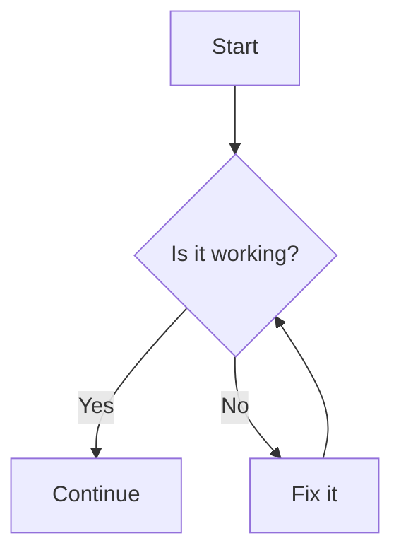
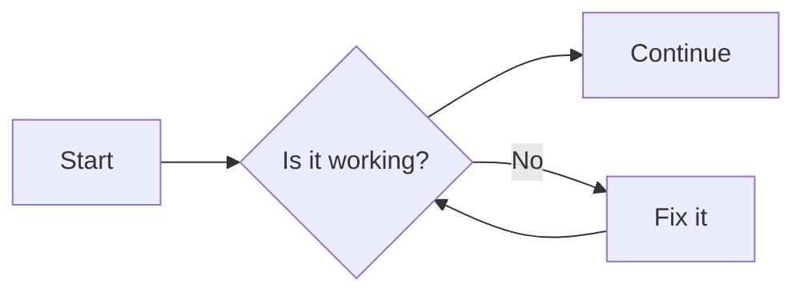

# Export styled Markdown to PDF for technical writing

## Linda Spiller -  December 2025
https://github.com/LJSpiller

---

## Why this matters
*This tutorial explains how to use a custom CSS style sheet with the Markdown PDF extension to create professional technical documentation as PDFs.*

Using Visual Studio Code is great for working with code samples but raw Markdown files aren't usually an acceptable file format for final portfolio samples or work documents that need to be shared or uploaded. 

Visual Studio Code relies on Chromium for PDF support. Sometimes the renderer used for Visual Studio Code extensions that export PDF can't render colors, emoji, or formatting styles correctly so a raw Markdown files that is directly exported to PDF may not meet professional formatting standards when using these extensions. For example, a green circle emoji used for a 200 HTTP status will appear as a black and white line emoji when Markdown content is exported to PDF. Likewise, it is difficult to add a header to mark a code sample's language or create callouts and warnings that are easy to identify.

The workaround for successfully creating a PDF document from a Markdown file is to export the document as an HTML file using the **Markdown PDF** Visual Studio Code extension. The HTML format preserves the formatting in the Markdown file and allows you to save the file as a PDF with the same formatting intact by using the "print to PDF" printing command in a browser. 

You can control the formatting for code samples, headings, lists, inline elements, table positioning, callouts, diagrams, and even emoji rendering by using a custom `markdown-pdf.css` with the Markdown PDF extension. 

---

## Prerequisites
- Visual Studio Code installed.  
- **Markdown PDF** extension (for export). [More information about this extension](https://marketplace.visualstudio.com/items?itemName=yzane.markdown-pdf).
 
- ***Optional:*** Markdown Preview Enhanced (for live diagram rendering).  

---

## Set up your CSS
Use this procedure to use the formatting in this document. You can adjust the rules as needed for your needs.

1. Create a new css stylesheet file called `markdown-pdf.css` in your project folder. 
2. Copy and paste the markdown-pdf-css style sheet located in the end of this tutorial into the new file. 

   This markdown-pdf-css file includes the following:
    - **Headings:** Custom font size, weight, and spacing.  
    - **Lists:** Nested bullets and numbered list alignment.  
    - **Inline code:** Custom formatting with dark gray text and light gray background.  
    - **Callouts:** Emoji and colored backgrounds for NOTE, WARNING, CAUTION. 
    - **Emoji:**  Red and Green circle emojis for HTTP statuses to indicate success or failure.  
    - **Tables:** Custom borders, alignment, and spacing. Page break protecction. 
    - **Page breaks:** `.new-page` class for manual control. 
  

3. (Optional) If you plan to use Mermaid.js diagrams and flowcharts, add this snippet to `markdown-pdf.css` to override gray backgrounds for Mermaid.  

   The outer block styling (gray background, padding, border) are still appled. However, you can add this snippet to the `markdown-pdf.css` file to override this behavior:

   ```css
   pre code.language-mermaid {
     background: transparent !important;
     border: none !important;
     padding: 0 !important;
   }
   ```


   <blockquote class="info">
   Mermaid.js is formatted like a code sample using backticks around the code for the diagram. In Visual Studio Code (and extensions like Markdown PDF or Markdown Preview Enhanced), fenced code blocks are styled with a background color (usually gray) to distinguish them from normal text. The renderer treats the diagram as a code block first, then passes the contents to the Mermaid renderer. 
</blockquote>

---

## Update Visual Studio Code settings

Add these changes to the Visual Code Studio settings JSON file so Visual Studio Code can use the Markdown PDF extension and apply the `markdown-pdf.css` style sheet.

1. Select the Gear icon in Visual Studio Code and select **Settings** from the menu.
2. Select the **Open Settings (JSON)** icon in the top right corner (It looks like a page with an arrow).
3. Add the following to the settings JSON file:

#### JSON
```JSON
"markdown-pdf.displayHeaderFooter": false,
"markdown-pdf.type": [
    "html",
    "png"
],
"markdown-pdf.fontFamily": "Segoe UI Emoji, Arial, sans-serif",
"markdown-pdf.styles": [
    "C:\\Users\\[full path for your directory]\\markdown-pdf.css"
]
```

<blockquote class="info">
You will need to escape the backslashes in the directory path by using a double set of backslashes instead of single backslash. 
</blockquote>

---

### Write Markdown content

In most cases, you can write Markdown as you normally would use Markdown. For example: 

- **Headings**: `## H2 Example`  

- **Lists**: Use `-` or `1.` for bullets and numbers.  
  
- **Inline code**: Use single backticks around content for inline code.The CSS style sheet formats the text as dark gray with a light gray background like this: 

  ``parameter_name``.  

- **Tables**: Use standard Markdown table formatting.

### Add callouts to your content 

You can copy and paste emoji into a Markdown file but many emoji are not supported by Chromium so they render as black and white icons when exported to a file format such as PDF. The fonts in this CSS style sheet are optimized for emoji for some file types. For best results either use emoji that are supported by Chromium or use Markdown PDF to export as a HTML file and then save as a PDF using the "Print to PDF printing" option in your browser.


This "NOTE" callout, which is similar to the style used by ReadMe, uses an emoji which is not supported in Chromium when exporting directly to PDF with the Markdown PDF extension. It will not be rendered as a blue book unless exported as an HTML file. 

```
> 📘 **NOTE:**
> 
> Code snippet for the example below. It uses Markdown formatting. It has a gray background.
```

> 📘 **NOTE:**
> 
> A useful note for technical documentation. Can used in ordered lists and indented under steps.

When a callout formatted as Markdown isn't compatable for a particular export, this `info` blockquote class uses the CSS style sheet to add in an emoji that is compatable with Chromium so it renders in most file types saved by Markdown PDF. 

```
<blockquote class="info">
Example of the code used for info note below. 
</blockquote>
```

<blockquote class="info">
This blockquote HTML class callout is an alternative to using the blue Note emoji and can be used for direct exports to Markdown using Markdown PDF. (It uses the CSS file and HTML.)
</blockquote>

<div class="new-page"></div>

## Add diagrams
Visual Studio Code and Markdown PDF support several code-based diagram tools.  

**Mermaid** → Create a fenced code block using `mermaid`.



**Add a header to a Mermaid.js diagram**

#### Troubleshooting diagram


Because the Mermaid.js diagram is a code block, it is possible to add a header like `#### Troubleshooting diagram` over the diagram using the same Markdown formatting as a code block label. Add `#### [label name]` above the diagram.

<br />

**PlantUML** → Use `@startuml … @enduml` (no backticks required).  

Unlike Mermaid.js diagrams, PlantUML diagrams do not require code blocks (triple backticks). As result these diagrams do not have gray backgrounds like code blocks. 

@startuml
Bob -[#red]> Alice : hello
Alice -[#0000FF]->Bob : ok
@enduml

<div class="new-page"></div>

## Use images

Markdown does not natively support resizing images, but you can resize images using embedded HTML. Note that some Markdown renderers do not suppport embedded HTML so you should test before deciding to not use Markdown. Use `./` before file name to indicate current directory. 

**Markdown:** 

``  

Sample image formatted with Markdown:

  


This image has a white background so adding a border will help prevent it from floating if the background is white. The border is defined in the CSS style sheet file. Use `` to add the border. 


**HTML:** 

Use `` for resizing width. Add `height="200"` before the closing bracket to change the height to 200 pixels. 
  
Sample image formatted with HTTL and sized:

  


## Format code blocks 

The CSS style sheet allows you to add a header with the name of the language above a fenced code sample. The style sheet places the header above the code block and removes the gap between the header and the code block. Use "#### [Language name]" above the code block to create the langage header above the code example. It will be black with white text in all caps. (You can adjust the CSS style sheet to change its look.) 

The Markdown PDF extension supports color syntax so use the offical language name next to the triple backticks at the top of the fenced code. For example, "```json" will enable the JSON color syntax. 

#### JSON
```json
{
  "api_version": "v1",
  "data": {
    "user_id": 9001,
    "status": "success",
    "is_admin": true,
    "last_login": "2025-10-26T10:00:00Z"
  },
  "errors": []
}
```

---

## Add emojis for status codes

Depending on the file type you are saving, it is possible to copy and paste an emoji from your computer's emoji panel (`Windows key` + `.` (period) or `Control` + `Command` + `Spacebar` for Mac). Sometimes this will work for exporting a file to a format other than PDF when using the Markdown PDF extension. 

🟢 **200** **Success.**

🔴 **400** **Request validation failed.** 

As an alternative, the CSS style sheet has an option to format red and green circle emojis using an HTML span so that they render correctly. You can add other emoji to the style sheet. 

`<span class="status-ok">200</span> **Success.**` 

<span class="status-ok">200</span> **Success.**

`<span class="status-error">400</span> **Request validation failed.**` 

<span class="status-error">400</span> **Request validation failed.**

The CSS style sheet controls the look and the placement of the emojis. It applies **bold** font to the HTTP status numbers inside the span but Markdown controls the formatting for the labels or text outside the span. The emoji do not appear in the Visual Studio Code preview pane but they are visible in the HTML page. 

---

## Export your file 

Once your content is ready, the next step is to export your file. Depending on the type of content in your Markdown file, you have two choices for exporting your file into PDF. 

* Export directly to PDF using Markdown PDF.
*  Export to HTML using Markdown PDF and then save the HTML file as a PDF using "Print to PDF."

**Export to PDF for simple Markdown files**

1. Right‑click your Markdown file, then select **Markdown PDF: Export (pdf)** from the menu. 

   **OR**

   Press the [F1] key on your keyboard, type "export" and select **Markdown PDF: Export (pdf)** from the menu. 
 
2. The Markdown PDF extension applies your custom CSS automatically and saves the PDF file in the directory listed in Settings.

3. Open the PDF and check the formating for all elements and page breaks. Since the PDF file is automatically saved by the Markdown PDF extension, if a page break is needed, use `<div class="new-page"></div>` to add a page break in the appropriate place in the Markdown file. 

   If emoji, callouts, images, and diagrams do not render correctly, use the procedure below to export to HTML first and then use your browser’s Print to PDF option.


**Alternative Method for Elements not supported by Chromium**

Use this method if elements aren't rendering correctly. You can change the scale and margins in the Print dialog.

1. Press the [F1] key on your keyboard, type "export" and select **Markdown PDF: Export (html)** from the menu. 
2. The extension applies your custom CSS automatically and saves the HTML file in the directory listed in your settings.
3. Open the HTML file. 
4. Scroll through the file to check the formatting and the page breaks. If a page break is needed, use `<div class="new-page"></div>` to add a page break in the appropriate place. Alternatively, you can use the scale and margin settings in your browser's print dialog to control the content. 

---

### Best practices
- Keep diagrams horizontal to avoid page breaks.  
- Use `<br />` for spacing in callouts.  
- Use placeholder text in code samples (`YOUR_API_KEY_HERE`).  
- Test exports in both dark and light themes.  
- Use emoji that render consistently in Chromium.

---

### Troubleshooting
- **Gray backgrounds on Mermaid** → Override with CSS.  
- **Emoji not rendering** → Copy from Windows emoji menu or use HTML entities.  
- **Tables splitting across pages** → Apply CSS to keep them intact.  
- **PlantUML not rendering in PDF** → pre‑generate diagrams as images and embed.

---

#### CSS | markdown-pdf.css style sheet
```css
/* ===========================
   General body text
   =========================== */
body {
  font-family: "Segoe UI", Arial, sans-serif;
  font-size: 14px;
  line-height: 1.6;
  font-weight: 400;
  color: #000;        /* Test color - change to 333 for testing and restore to black after setup */
  margin: 20px;
}

/* ===========================
   Headings & Page Break Control (Avoid break *after* heading)
   =========================== */
h1, h2, h3, h4 {
  font-weight: 600;
  color: #222;
  margin-top: 1.5em;
  margin-bottom: 0.5em;
  page-break-after: avoid;
}

/* ===========================
   Inline code (paragraphs, lists, tables)
   =========================== */
p code,
li code,
td code,
th code {
  background-color: #f5f7fa;
  border: 1px solid #e1e4e8;
  border-radius: 3px;
  padding: 2px 4px;
  font-family: Consolas, "Courier New", monospace;
  font-size: 90%;
  color: #333 !important;   /* force dark gray inline code */
  display: inline;
}

/* ===========================
   Code blocks (Standard)
   =========================== */
pre {
  font-family: Consolas, "Courier New", monospace;
  background-color: #f5f7fa;
  border: 1px solid #e1e4e8;
  border-radius: 4px;
  position: relative;
  padding: 6px 10px;
  overflow-x: auto;
  color: #2a2a2a;
  margin: 1em 0;
  
  /* Prevent code blocks from splitting across pages */
  page-break-inside: avoid; 
}

/* =======================================
   Header Gap Fix (Code Block Label)
   ======================================= */

/* 1. Style the H4 to look like a clean label bar */
h4:has(+ pre) { 
  background-color: #343a40; /* Dark gray background */
  color: #f8f9fa;            /* Light text color */
  padding: 5px 10px;
  margin-bottom: 0;          /* Remove space between H4 and <pre> */
  margin-top: 1.5em;         /* Restore standard top spacing */
  font-size: 12px;
  font-weight: 700;
  text-transform: uppercase;
  border-top-left-radius: 4px;
  border-top-right-radius: 4px;
}

/* 2. Snap the code block up to remove the gap and align the borders */
h4 + pre {
  margin-top: 0;                  /* Pull the code block up */
  border-top-left-radius: 0;      /* Align corners with the H4 bar */
  border-top-right-radius: 0;
}


/* ===========================
   Tables & Page Break Control
   =========================== */
table {
  border-collapse: collapse;
  width: 100%;
  margin: 1em 0;
  
  /* Prevent tables from splitting across pages */
  page-break-inside: avoid; 
}
th, td {
  border: 1px solid #ddd;
  padding: 8px;
}
th {
  background-color: #f0f2f5;
  font-weight: 600;
}

/* ===========================
   Lists
   =========================== */
ol {
  list-style-position: outside;
  margin: 0 0 1em 0;
  padding-left: 2em;
}
ul {
  list-style-position: outside;
  margin: 0 0 1em 0;
  padding-left: 1.5em;
}
ol ol, ul ul {
  margin: 0.5em 0;
  padding-left: 2em;
}

/* ===========================
   Links
   =========================== */
a {
  color: #0066cc;
  text-decoration: none;
}
a:hover {
  text-decoration: underline;
}

/* ===========================
   Blockquotes (Callouts) & Page Break Control
   =========================== */
blockquote {
  border-left: 4px solid #0066cc;
  background-color: #f5f7fa;
  padding: 10px 15px;
  margin: 1em 0;
  color: #333;
  font-style: normal;
  border-radius: 4px;
  
  /* Prevent callout boxes from splitting across pages */
  page-break-inside: avoid; 
}

/* NOTE, WARNING, CAUTION, SUCCESS, INFO, TIP (Callout Styles) */
blockquote.note { border-left-color: #0066cc; background-color: #e9f2fb; }
blockquote.note::before { content: "📘 NOTE:"; font-weight: 700; color: #0066cc; display: block; margin-bottom: 4px; font-family: "Segoe UI Emoji","Noto Color Emoji","Segoe UI",Arial,sans-serif; }

/* WARNING */
blockquote.warning { border-left-color: #dc3545; background-color: #fbeaea; }
blockquote.warning::before { content: "❗ WARNING:"; font-weight: 700; color: #dc3545; display: block; margin-bottom: 4px; font-family: "Segoe UI Emoji","Noto Color Emoji","Segoe UI",Arial,sans-serif; }

/* CAUTION */
blockquote.caution { border-left-color: #ffcc00; background-color: #fffbe6; }
blockquote.caution::before { content: "⚠️ CAUTION:"; font-weight: 700; color: #ffab00; display: block; margin-bottom: 4px; font-family: "Segoe UI Emoji","Noto Color Emoji","Segoe UI",Arial,sans-serif; }

/* SUCCESS */
blockquote.success { border-left-color: #28a745; background-color: #e9f7ef; }
blockquote.success::before { content: "✅ SUCCESS:"; font-weight: 700; color: #28a745; display: block; margin-bottom: 4px; font-family: "Segoe UI Emoji","Noto Color Emoji","Segoe UI",Arial,sans-serif; }

/* INFO */
blockquote.info { border-left-color: #17a2b8; background-color: #e8f6f9; }
blockquote.info::before { content: "ℹ️ INFO:"; font-weight: 700; color: #17a2b8; display: block; margin-bottom: 4px; font-family: "Segoe UI Emoji","Noto Color Emoji","Segoe UI",Arial,sans-serif; }

/* TIP */
blockquote.tip { border-left-color: #20c997; background-color: #e6f9f5; }
blockquote.tip::before { content: "💡 TIP:"; font-weight: 700; color: #20c997; display: block; margin-bottom: 4px; font-family: "Segoe UI Emoji","Noto Color Emoji","Segoe UI",Arial,sans-serif; }


/* ===========================
   Horizontal rules
   =========================== */
hr {
  border: 0;
  border-top: 1px solid #ddd;
  margin: 2em 0;
}

/* ===========================
   Images
   =========================== */
img {
  max-width: 100%;
  height: auto;
  margin: 1em 0;
  border: 1px solid #eee;
  border-radius: 4px;
  
  /* Prevent images from splitting across pages */
  page-break-inside: avoid; 
}
img[src*="#bordered"] {
  border: 1px solid #888;
  padding: 4px;
  border-radius: 4px;
}

/* ===========================
   Status codes (red/green circles)
   =========================== */
.status-ok::before {
  content: "🟢";
  font-family: "Segoe UI Emoji","Noto Color Emoji";
  margin-right: 0.25em;
  vertical-align: top;
}

.status-error::before {
  content: "🔴";
  font-family: "Segoe UI Emoji","Noto Color Emoji";
  margin-right: 0.25em;
  vertical-align: top;
}

.status-ok,
.status-error {
  font-weight: 700;
}

/* =======================================
   MANUAL PAGE BREAK CLASS 
   ======================================= */
.new-page {
  /* This is the key CSS property for forcing a break in PDF/Print - use sparingly*/
  page-break-after: always;
}
```
